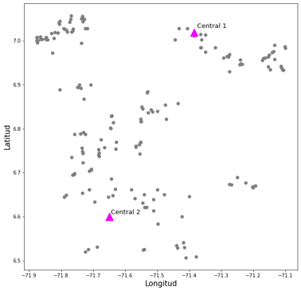

# Modelo Ruteo de cacao en Arauca, Colombia
En el presente repositorio se encuentran los resultados principales y el código fuente relacionado con un modelo de ruteo implementado por etapas. El objetivo del ruteo es generar un transporte eficiente de mazorcas de cacao desde 180 fincas cacaoteras hacia 2 centrales post cosecha.
## Ubicación de Fincas y Centrales en el espacio

Se cuentan con las coordenadas reales de la central 1, pero se tienen coordenadas teóricas para la central 2. Las 180 fincas se ven representadas como los puntos grises.

## Metodología empleada
La metodología desarrollada consta de 3 etapas principales. Primero, una etapa de asignación de cada finca a una de las dos centrales post cosecha. Segundo, una etapa de clustering en la cual se evaluaron tres algoritmos diferentes. Y tercero, una etapa de ruteo con un modelo clásico de programación lineal.

A continuación se encuentran enlaces que dirigen al código fuente desarrollado en cada una de las etapas junto con los resultados obtenidos:
- Etapa 1 (Modelo de asignación)
- Etapa 2 (Métodos de Clustering)
- Etapa 3 (Modelo de ruteo)

